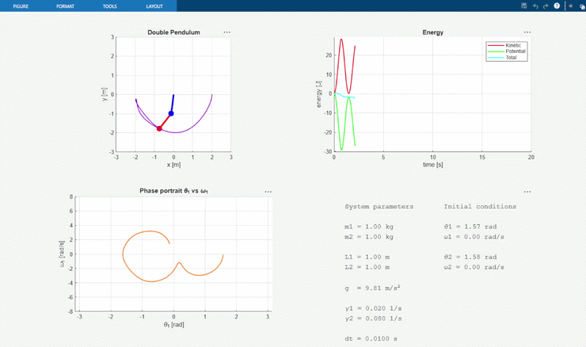

# Double Pendulum Simulation

Real-time simulation of a chaotic double pendulum system, written in MATLAB and Python.
More detailed scientific- and engineering-based information of the system, numerical algorithm, motion equations and total summary can be found in dedicated file.

## Demonstration

Below is demonstrated Python version of simulation

Below is demonstrated MATLAB version of simulation

## Main features

Main features:
- RK4 (Runge-Kutta of the 4th order) numerical integrator
- Real-time calculation of the motion's equations
- Real-time simulation rendering 
- Kinetic, potential and total system's energies analysis and live visualization
- Phase portrait 
- Tracking of chaotic trajectory of the second mass 

## Models descriptions and notices

### Computational notices
The masses of the rods $L_1$ and $L_2$ are omitted and the rods assumed to be massless, masses $m_1$ and $m_2$ are treated as the point masses, the whole system is in 2D due to pendulum simplification

### Physical model

System consists of two connected pendulums, moving in a two-dimensional plane. The motion equations provide only the instantaneous derivatives of the state vector. The actual time evolution is obtained by the RK4 integrator, which repeatedly applies these derivatives to update the angular positions and velocities. The motion equations are obtained from the system's Lagrangian. The equations of motion return only the derivatives of the current state:

$$
f(y) =
\begin{bmatrix}
\omega_1 \\
\alpha_1 \\
\omega_2 \\
\alpha_2
\end{bmatrix}
$$

These derivatives describe how the system is changing at a single moment in time.  
The RK4 method uses several derivative evaluations inside one time step to approximate the next state:

$$
y(t + \Delta t)
$$

Thus, the derivative function describes the local dynamics, while the RK4 method constructs the time evolution of the pendulum.

### Numerical algorithm

The choice of the used numerical algorith bases on the most efficient and accurate algorithm exactly for this problem. Main factors were:
- Accuracy under conditions of non-linearity and chaos
- Exprected computational needs
- animation adaptivity
- accuracy under conditions of energy loss and motion depression
- convenience under one-step computation

It is important to notice, that double pendulum is a nonlinear and chaotic system, so small numerical errors can grow quickly and noticeably affect the simulated motion, thats why the exactly fourth-order Runge–Kutta method was chosen due to a good balance between accuracy, numerical stability and computational cost.
