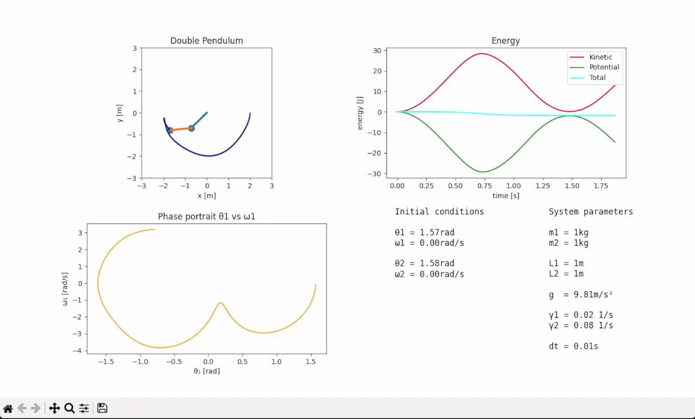

Double Pendulum Simulation

Real-time simulation of a chaotic double pendulum system.

Main features:
- RK4 numerical integrator
- Real-time visualization
- Energy analysis
- Phase portrait 
- Chaotic trajectory tracking
